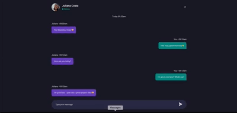

# Chat

This is a project part of a course by the company 'Rocketseat'. It is a chat UI built using HTML, CSS and JavaScript.

[🔗 Click here to access it]()

 

  

 

  

## 🚀 Technologies

This project was developed using the following technologies:

- HTML
- CSS
- Javascript
- Git & Github
- Figma

## :memo: License

This project is under the MIT license.
